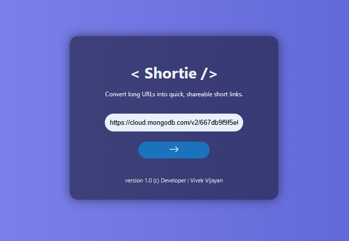
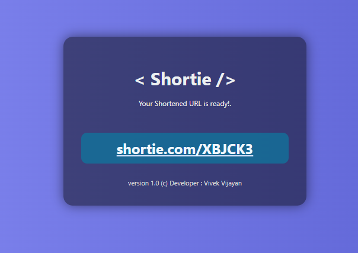

# 🔗 Shortie - URL Shortener

**Shortie** is a fast, minimal, and developer-friendly URL shortener built with **FastAPI**, **MongoDB**, and **Bloom Filters**. It provides a clean HTML interface and can be easily self-hosted — perfect for shortening long URLs or creating custom branded links for personal or internal use.

### Homepage



### Shortened Page


## 🚀 Features

- ✅ Shorten long URLs into custom or auto-generated slugs
- 🌱 Prevent duplicate entries with **Bloom Filter**-based checks
- ⚡ Built on **FastAPI** for speed and scalability
- 🧩 Modular codebase for easy customization and extension
- 💾 Persistent storage using **MongoDB**
- 🖥️ Lightweight frontend using plain HTML templates


## 🛠️ Tech Stack

- **Framework**: [FastAPI](https://fastapi.tiangolo.com)
- **Database**: [MongoDB](https://www.mongodb.com)
- **Algorithm**: Bloom Filter (in-memory existence check)
- **Frontend**: HTML (Jinja2 templating via FastAPI)
- **Deployment**: Docker

## 🔧 Setup Instructions

### 🔌 Local Development

1. **Clone the repo**
   ```bash
   git clone https://github.com/yourusername/shortie-url-shortener.git
   cd shortie-url-shortener/src
Create and activate virtual environment

bash
Copy
Edit
python -m venv venv
source venv/bin/activate  # Windows: venv\Scripts\activate
Install dependencies

bash
Copy
Edit
pip install -r requirements.txt
Configure environment
Create a .env file inside src/:

bash
Copy
Edit
MONGO_URI=mongodb://localhost:27017/shortie
#  Run the application

uvicorn app:app --reload
Open http://localhost:8000 in your browser.

🐳 Docker Deployment

`cd src`

`docker build -t shortie-url-shortener .`

`docker run -d -p 8000:8000 --env-file .env shortie-url-shortener`

# 🤝 Contributing
Contributions, issues, and feature requests are welcome!
Feel free to fork this project and submit a PR.

# 📄 License
This project is licensed under the MIT License. See the LICENSE file for more information.

# 👤 Author
- Vivek Vijayan
- 📫 [vijayanv31@gmail.com]

